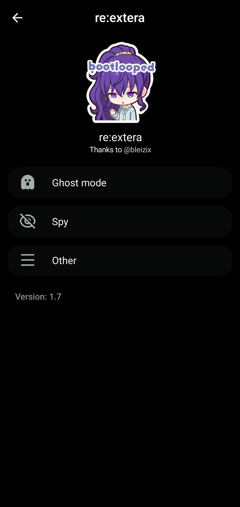
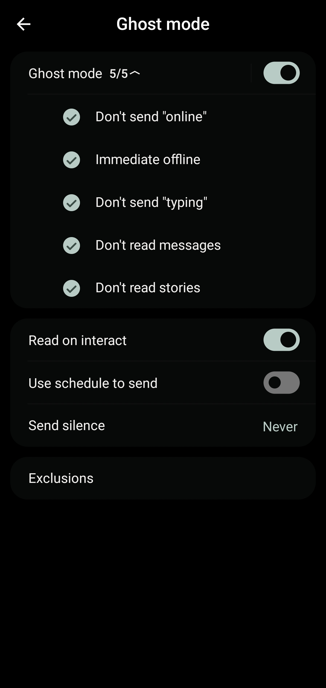
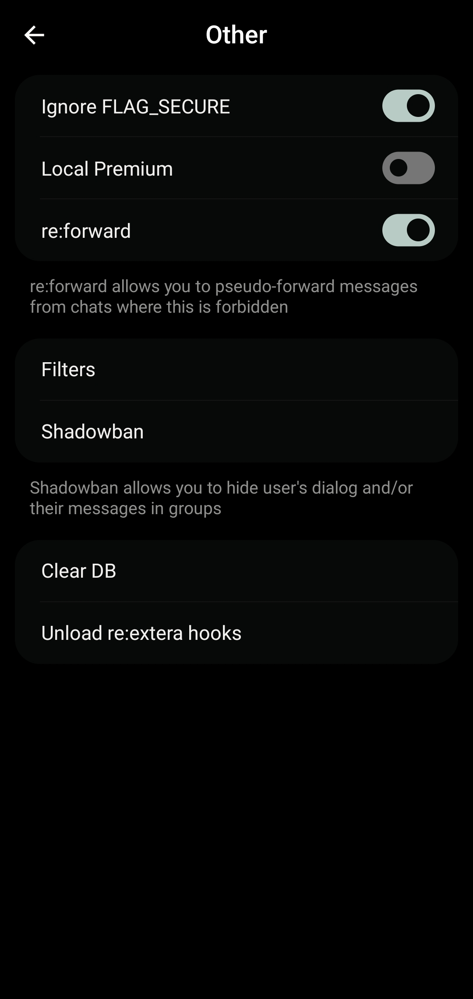

## re:extera
*[Licensed under the GNU General Public License v3.0](LICENSE)*

Plugin for exteraGram / AyuGram that adds ghost mode, deleted message recovery, and various other features. Loaded at runtime via DEX injection.

[](https://t.me/shikaatuProjectsLog)
[](https://github.com/fossSquad/re-extera/releases/latest)

### Features
- **Ghost mode** — hide online status, typing indicator, read receipts, and story views
- **Spy** — save deleted messages, self-destructing messages, message history with custom markers
- **re:forward** — pseudo-forward messages from chats where forwarding is restricted
- **Shadowban** — hide specific user's messages or entire dialogs
- **Local Premium** — unlock premium-like features locally
- **Filters** — advanced message filtering

### Screenshots
| | | | |
|---|---|---|---|
|  |  |  |  |
| Main menu | Ghost mode | Spy | Other |

### Building
```
git clone https://github.com/fossSquad/re-extera.git
cd re-extera
./gradlew buildDex
```

Output DEX will be at `build/dex/classes.dex`. The CI also produces builds automatically — grab latest from [Actions](https://github.com/fossSquad/re-extera/actions) (dev) or [Releases](https://github.com/fossSquad/re-extera/releases) (stable).

### Installing
1. Install the plugin via the [loader](https://github.com/fossSquad/re-extera/releases/latest/download/loader.plugin) — put it in `AyuGram/plugins/` or `exteraGram/plugins/`
2. The plugin will download and load the DEX automatically
3. Switch between dev (nightly) and release (stable) channels in plugin settings

### Dev builds
Latest dev builds are available as CI artifacts. Set the plugin channel to **Dev** to auto-update from the latest commit — no manual download needed.

### Credits
- [@bleizix](https://github.com/bleizix) — original idea and implementation
- [@shikaatux](https://github.com/shikaatux) — plugin engine, loader, and ongoing development
- [exteraGram](https://github.com/exteraSquad/exteraGram) / [AyuGram](https://github.com/AyuGram/AyuGram) — plugin runtime
