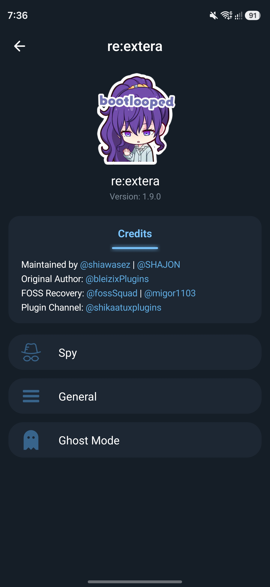
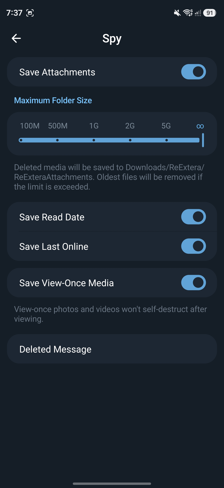
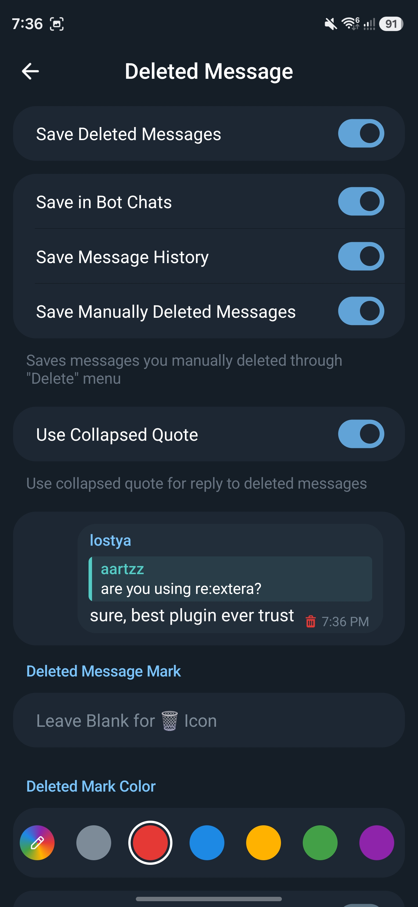
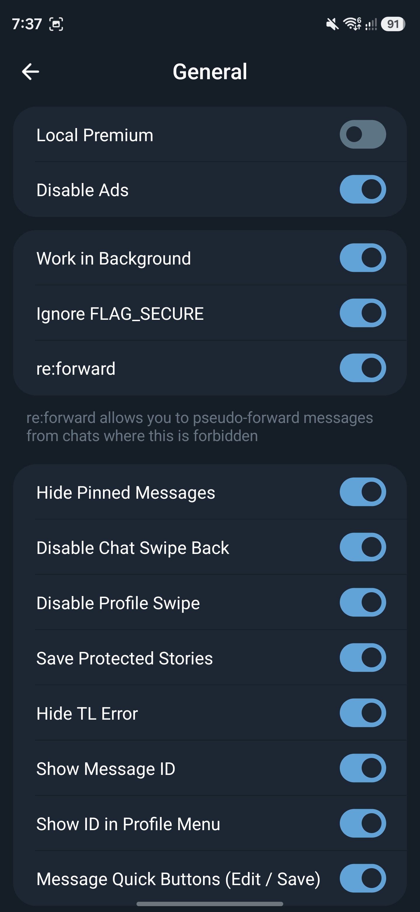
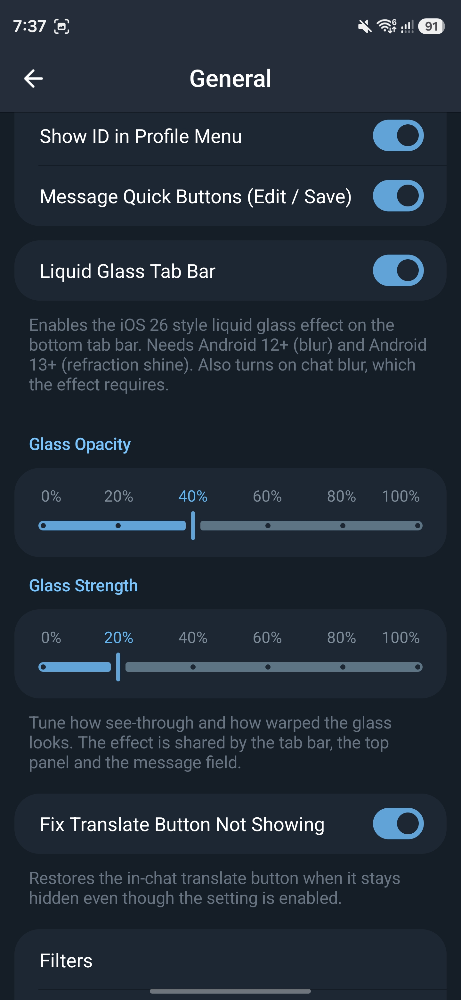
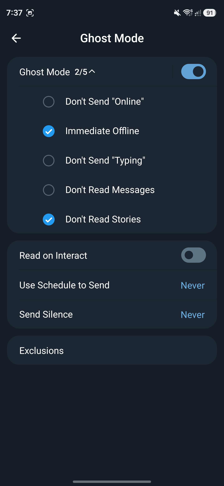

<div align="center">


# re:extera

**iOS-26 liquid glass UI · ghost mode · deleted-message recovery — and much more for exteraGram**

<sub>An exteraGram plugin, loaded at runtime via DEX injection</sub>

</div>

### Features
- **Ghost mode** — hide online status, typing, read receipts and story views; immediate offline, read-on-interact, scheduled/silent send, and per-chat exclusions
- **Spy** — recover deleted & edited messages with history, save self-destructing (view-once) media and attachments, custom deleted-message marks & colors
- **Liquid Glass UI** — iOS-26 style liquid glass bottom tab bar with in-app **Opacity** and **Strength** sliders
- **Fix Translate Button** — restore the in-chat "Translate" bar when exteraGram hides it for non-Premium accounts
- **re:forward** — pseudo-forward messages from chats where forwarding is restricted
- **Quick buttons & IDs** — per-message edit / cloud-save side buttons, show message ID and profile/channel IDs
- **Privacy & tweaks** — ignore `FLAG_SECURE`, save protected stories, disable ads, hide pinned messages, work in background, hide TL errors
- **Shadowban** — hide a specific user's messages or entire dialogs
- **Local Premium** — unlock premium-like features locally
- **Filters** — advanced regex message filtering

### Screenshots

<div align="center">

|  |  |  |
|:---:|:---:|:---:|
|  |  |  |
| **Home & credits** | **Spy** | **Deleted messages** |
|  |  |  |
| **General** | **Liquid glass & translate** | **Ghost mode** |

</div>

### Building

**Requirements**
- Android SDK
- JDK 17
- Python 3.x

```bash
git clone https://github.com/fossSquad/re-extera.git
cd re-extera

# build .plugin
python3 loader/build.py

# build .dex
./gradlew buildDex
```

Output DEX will be at `build/dex/classes.dex`. The CI also produces builds automatically — grab latest from [Actions](https://github.com/fossSquad/re-extera/actions) (dev) or [Releases](https://github.com/fossSquad/re-extera/releases) (stable).

### Installing
1. Install the [loader](https://github.com/fossSquad/re-extera/releases/latest/download/loader.plugin)
2. The plugin will download and load the DEX automatically
3. Switch between dev (nightly) and release (stable) channels in plugin settings

### Dev builds
Latest dev builds are available as CI artifacts. Set the plugin channel to **Dev** to auto-update from the latest commit — no manual download needed.

### Credits
- **Original author** — [@bleizix](https://t.me/bleizix)
- **First fork maintainer** — [@shiawasez](https://t.me/shiawasez)
- **Current fork maintainers**
  - [@SHAJON](https://t.me/SHAJON) · [GitHub](https://github.com/SHAJON-404)
  - [@migor1103](https://t.me/migor1103) · [GitHub](https://github.com/fossSquad)

Built on [exteraGram](https://github.com/exteraSquad/exteraGram) — the plugin runtime.

### License
re:extera is free software, released under the [GNU General Public License v3.0](LICENSE).
